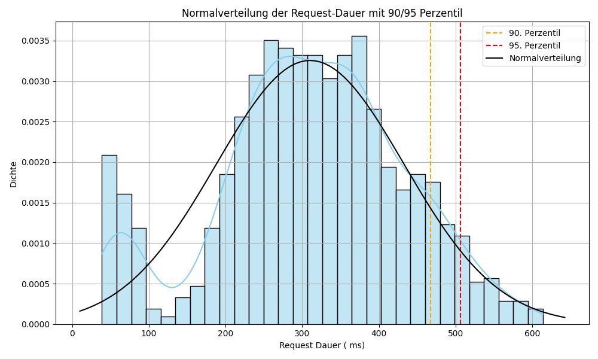

# Baseline Report

## Docker Environment

### Performance Metrics
| Metric        | Value      |
|---------------|------------|
| Mean Request Duration | ~330 ms    |
| 90th Percentile | ~470 ms    |
| 95th Percentile | ~500 ms    |

### CPU Usage
|Server   | Min  | Max  | Mean |
|---------|------|------|------|
|pay-int-1| 20.0 | 61.2 | 30.6 |
|pay-int-2| 22.5 | 72.0 | 36.3 |

### Memory Usage
|Server   | Last     | Mean     |
|---------|----------|----------|
|pay-int-1| 19.5 GiB | 19.4 GiB |
|pay-int-2| 19.0 GiB | 19.0 GiB |

### Disk I/O
| Metric                                        | Value      |
|-----------------------------------------------|------------|
| `...integration1-vm.sdb` Read Time              | 4.51 ms    |
| `...integration2-vm.sdb` Read Time              | 400 µs     |
| `...integration1-vm.sdb` Read Bytes             | 825 kB/s   |
| `...integration2-vm.sdb` Read Bytes             | 22.7 kB/s  |

## PHP Application

### Performance Metrics
| Metric        | Value      |
|---------------|------------|
| Mean Request Duration | ~1750 ms   |
| 90th Percentile | ~2500 ms   |
| 95th Percentile | ~2800 ms   |

### CPU Usage
| Min  | Max  | Mean |
|------|------|------|
| 23.0 | 44.9 | 31.4 |
| 18.8 | 49.3 | 28.8 |

### Memory Usage
| Last     | Mean     |
|----------|----------|
| 19.2 GiB | 19.2 GiB |
| 19.0 GiB | 18.9 GiB |

### Disk I/O
| Metric                                    | Value     |
|-------------------------------------------|-----------|
| `...integration2-vm.sdb` Read Time          | 6.86 ms   |
| `...integration1-vm.sdb` Read Bytes         | 356 kB/s  |
| `...integration2-vm.sdb` Read Bytes         | 19.7 kB/s |

## Database Replication
| Instance      | Seconds Behind Master |
|---------------|-----------------------|
| Integration 1 |                       |
| Integration 2 |                       |